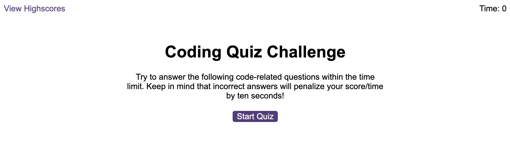
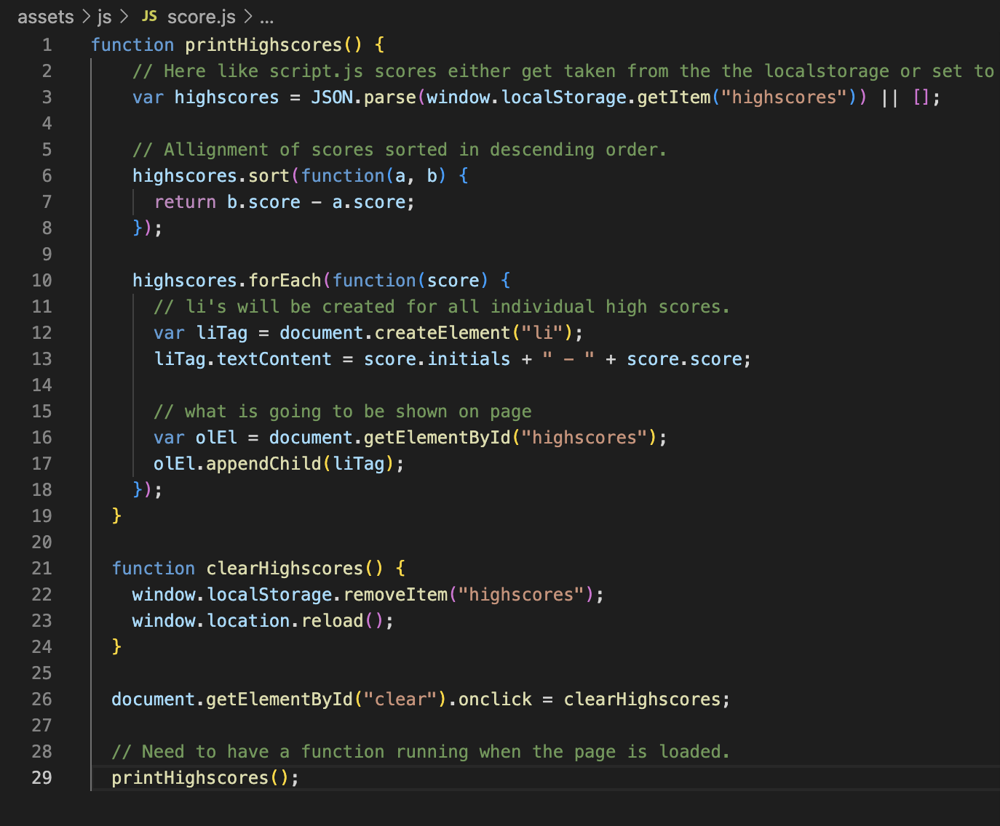
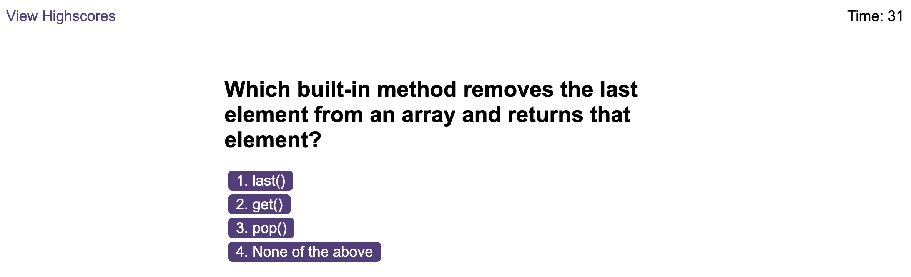

# API-code-quiz

## Description

I have coded the javascript with a wide range of questions put together in a quiz alongside the HTML and CSS that i was given, I belive it runs really smoothly and works exactally how intended. 

User story:
Now integrated as a fully coding bootcamp student i have made here a timed quiz using javascript fundamentals, with flashes and high scores and feedback realted to timers.

API's are something i deal with in my Prosuct analyst role, speaking to the back end developers, it's great to finally be able to understand and know how it works.

## Screenshots

## Link

## License
MIT license